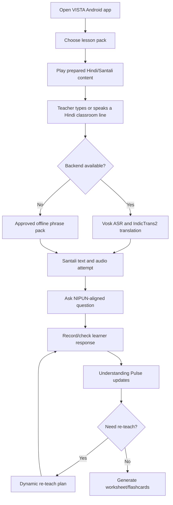

# VISTA Methodology and Project Workflow

## Methodology

1. Need identification
   - Target users are primary-school teachers who speak Hindi but teach children whose strongest classroom language is Santali, Ho, or Mundari.
   - The immediate prototype language is Santali because one language must work deeply before scaling.

2. Content preparation
   - Collect Hindi FLN lesson scripts, classroom instructions, activity prompts, assessment prompts, and vocabulary.
   - Translate with IndicTrans2 and/or LLM assistance.
   - Review every translation with a language reviewer before packaging for children.

3. Offline language pack creation
   - Build a pack containing bilingual text, glossary, approved teacher phrases, worksheets, flashcards, and audio assets.
   - Include high-frequency classroom audio clips first because Santali TTS is still a weak ecosystem area.

4. Classroom delivery
   - Teacher selects lesson and student language.
   - App plays prepared Hindi/Santali content and supports live Hindi input.
   - If Ubuntu backend is running, typed or spoken Hindi goes through IndicTrans2/Vosk.
   - If backend is unavailable, the app uses approved offline phrase matching for common classroom instructions.

5. Understanding measurement
   - Teacher asks one oral question aligned to the learning outcome.
   - Student response is recorded as Understood, Unsure, or Needs Help.
   - Understanding Pulse updates class-level counts, confidence, misconception notes, and next teaching action.

6. Adaptive re-teaching
   - When multiple learners struggle with the same concept, the Re-teach tab changes automatically.
   - The plan gives a visual cue, short Hindi line, Santali line, follow-up question, and recheck instruction.

7. Worksheet generation
   - Teacher chooses topic and grade.
   - App generates a printable bilingual worksheet with match-the-following, fill-in-the-blank, MCQ, oral check, teacher note, and flashcards.

## Working Prototype Flow

## Final Product Workflow

## Why the Solution Is Useful

VISTA is useful because it does not require every teacher to become fluent in every local tribal language before teaching. It gives the teacher reviewed Santali content, live Hindi-to-Santali assistance, bilingual learning materials, and a practical way to see whether children understood the concept. It is most valuable in early-grade FLN classrooms where misunderstanding the language of instruction can block reading, numeracy, and classroom confidence.

## What Still Needs Real-World Validation

- Translation quality must be reviewed by Santali speakers.
- Santali TTS should be tested through Bhashini or expanded with recorded school-domain audio.
- Ho and Mundari should be added as separate language packs, not just labels.
- Offline ASR latency must be measured on the exact low-cost tablet model, not only on emulator.
