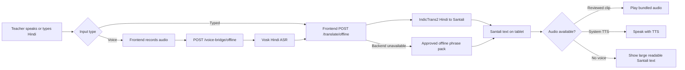
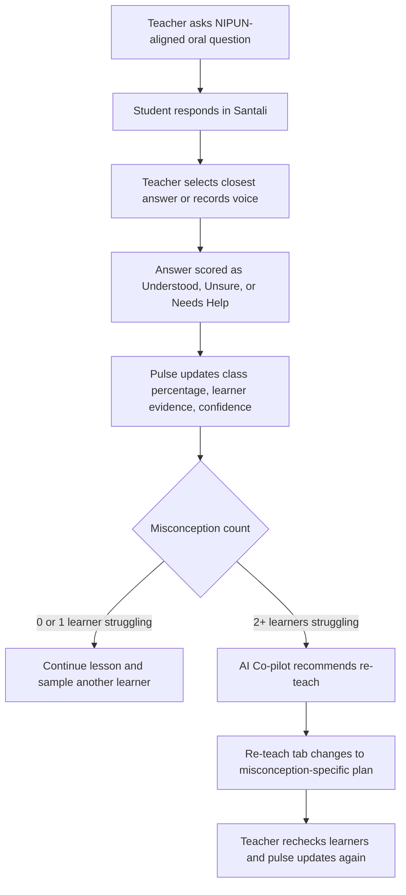

# VISTA Technologies and Function Flow

## Technologies Used

| Technology | Function in VISTA |
| --- | --- |
| Android 9+ WebView via Capacitor | Packages the classroom app as an Android APK for low-cost tablets and emulator demos. |
| HTML, CSS, JavaScript | Runs the offline teacher interface, worksheets, flashcards, Understanding Pulse, and fallback translation pack. |
| FastAPI | Backend API for translation, speech bridge, student assessment, curriculum generation, and sync/export endpoints. |
| AI4Bharat IndicTrans2 | Local Ubuntu translation engine for Hindi-to-Santali text translation through `/translate/offline`. |
| Vosk offline ASR | Offline Hindi speech recognition for the `/voice-bridge/offline` classroom voice bridge. |
| Approved phrase/domain packs | Fast on-device fallback for common classroom instructions when the model or internet is unavailable. |
| Web Speech / Android TTS fallback | Attempts target-language audio playback when a compatible voice exists; otherwise uses reviewed audio clips. |
| SQLite export bundle | Future tablet sync format for reviewed translations, worksheets, audio files, and learning-outcome metadata. |
| SQLite | Local database for concepts, questions, translation drafts, approvals, worksheets, and learner attempts. |
| NIPUN Bharat FLN mapping | Aligns lessons, oral checks, worksheets, and pulse evidence to learning outcomes. |

## Translation and Voice Flow

## Understanding Pulse Flow

## Offline Content Sync Flow

## Feasible Speech Source Options

| Need | Best source or route |
| --- | --- |
| Hindi offline speech-to-text | Vosk Hindi model or Bhashini/AI4Bharat Hindi ASR during connected preparation. |
| Hindi/Santali translation | AI4Bharat IndicTrans2, plus fine-tuning with FLN Hindi-Santali parallel sentences. |
| Santali TTS | Bhashini lists Santali TTS in Devanagari-script support; `santali-textts` exists but is limited-vocabulary beta. For dependable classroom use, ship reviewed Santali audio clips for high-frequency lines while collecting speech data. |
| Ho and Mundari expansion | Use the same language-pack architecture: glossary, classroom phrases, lesson scripts, recordings, and reviewer approval. |

## Usefulness Assessment

This project does address the tribal-language classroom barrier at prototype level because it helps a Hindi-speaking teacher deliver prepared mother-tongue explanations, ask bilingual checks, generate FLN worksheets, and react to learner confusion without prior Santali training.

The production risk is open-ended speech. For reliable real classrooms, keep the system hybrid: model translation when confident, approved phrase/audio packs for common classroom moments, and human-reviewed curriculum packs for lessons.
